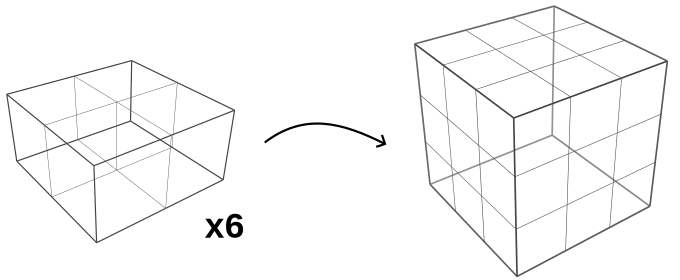
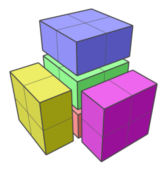
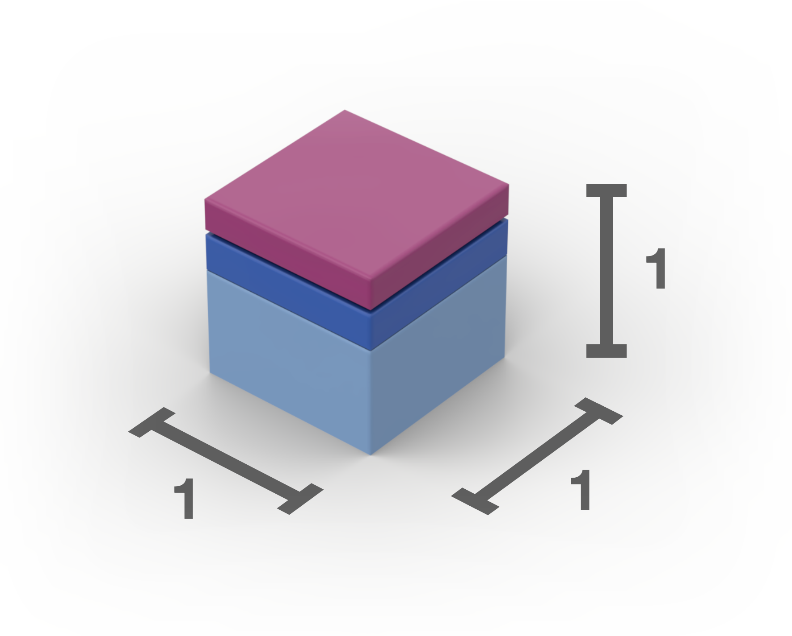
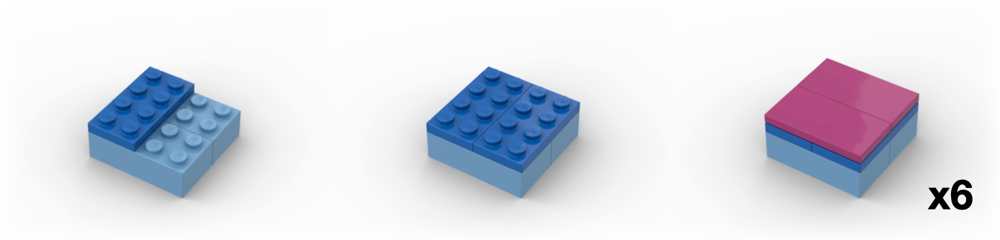
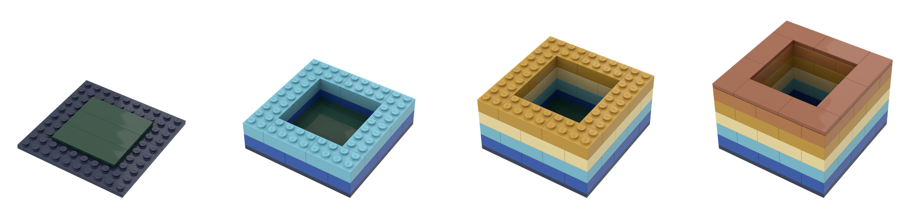
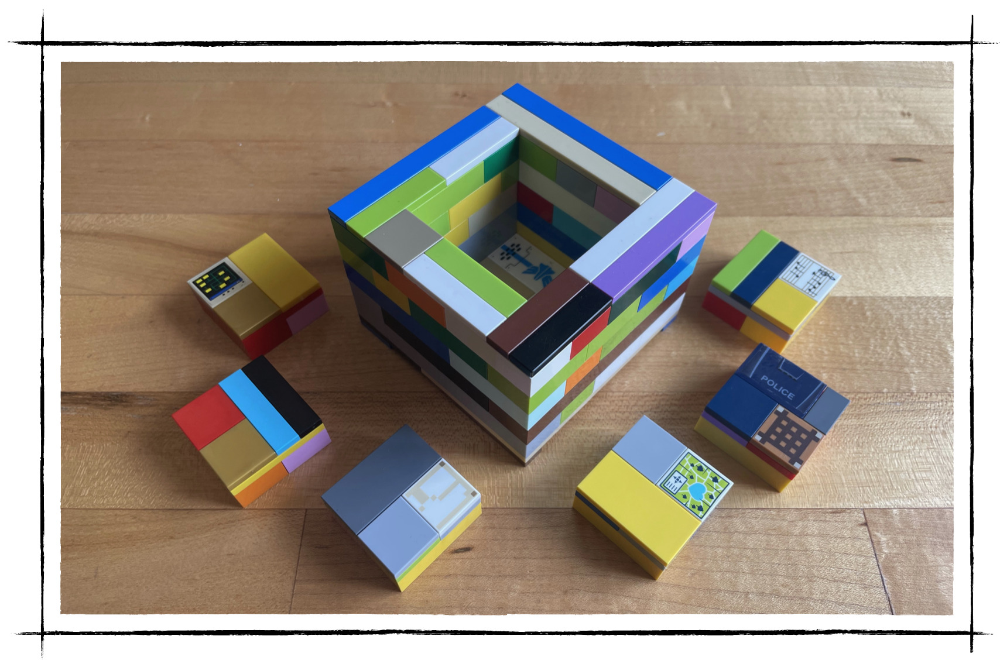

% A Simple 3D Puzzle
% Tyler Neylon
% 345.2023

\newcommand{\R}{\mathbb{R}}
\newcommand{\N}{\mathbb{N}}
\newcommand{\eqnset}[1]{\left.\mbox{$#1$}\;\;\right\rbrace\class{postbrace}{ }}
\providecommand{\latexonlyrule}[3][]{}
\providecommand{\optquad}{\class{optquad}{}}
\providecommand{\smallscrneg}{\class{smallscrneg}{ }}
\providecommand{\bigscr}[1]{\class{bigscr}{#1}}
\providecommand{\smallscr}[1]{\class{smallscr}{#1}}
\providecommand{\smallscrskip}[1]{\class{smallscrskip}{\hskip #1}}

\newcommand{\mydots}{{\cdot}\kern -0.1pt{\cdot}\kern -0.1pt{\cdot}}

\newcommand{\?}{\stackrel{?}{=}}
\newcommand{\sign}{\textsf{sign}}
\newcommand{\order}{\textsf{order}}
\newcommand{\flips}{\textsf{flips}}
\newcommand{\samecycles}{\textsf{same$\\\_$cycles}}
\newcommand{\canon}{\textsf{canon}}
\newcommand{\cs}{\mathsf{cs}}
\newcommand{\dist}{\mathsf{dist}}
\renewcommand{\theenumi}{(\roman{enumi})}

[
Formats:
 [html](http://tylerneylon.com/a/lego_puzzle/lego_puzzle.html) |
 [pdf](http://tylerneylon.com/a/lego_puzzle/lego_puzzle.pdf)
 $\,$
]

Here's a fun puzzle: Take six boxes, each $1\times 2\times 2$ in size,
and find a way to pack them into a $3\times 3\times 3$ cube.

I learned about this puzzle through Donald Knuth's
*The Art of Computer Programming,* $\S 7.2.2.1$.
The six boxes have a total volume of 24 cubies (I'll call a $1\times 1\times 1$
unit a "cubie," as Knuth does). They certainly have a chance of
fitting into the 27 cubie spaces of the larger $3\times 3\times 3$
volume. But the initial configurations I tried failed to fit more than
five boxes in the space allowed:

You might be able to solve this by simply thinking about it.
But it's even more fun to play with a physical model.
\newline Did you know that a $2\times 2$ Lego brick with 2
tile-heights on top forms a perfect cube?

This allows us to construct the puzzle like so:

{width=90%}
{width=90%}

Here's the hodgepodge model I built with my kids' Legos:

