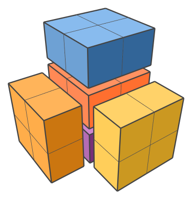
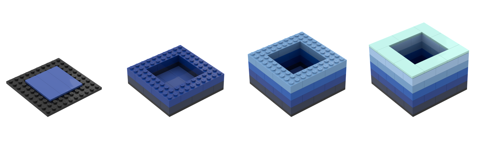
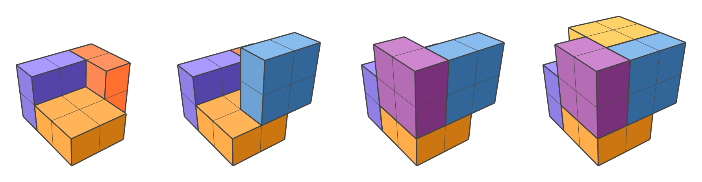
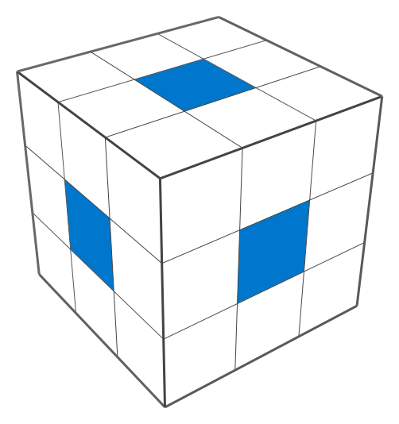

% A Simple 3D Puzzle
% Tyler Neylon
% 345.2023

\newcommand{\R}{\mathbb{R}}
\newcommand{\N}{\mathbb{N}}
\newcommand{\eqnset}[1]{\left.\mbox{$#1$}\;\;\right\rbrace\class{postbrace}{ }}
\providecommand{\latexonlyrule}[3][]{}
\providecommand{\optquad}{\class{optquad}{}}
\providecommand{\smallscrneg}{\class{smallscrneg}{ }}
\providecommand{\bigscr}[1]{\class{bigscr}{#1}}
\providecommand{\smallscr}[1]{\class{smallscr}{#1}}
\providecommand{\smallscrskip}[1]{\class{smallscrskip}{\hskip #1}}

\newcommand{\mydots}{{\cdot}\kern -0.1pt{\cdot}\kern -0.1pt{\cdot}}

\newcommand{\?}{\stackrel{?}{=}}
\newcommand{\sign}{\textsf{sign}}
\newcommand{\order}{\textsf{order}}
\newcommand{\flips}{\textsf{flips}}
\newcommand{\samecycles}{\textsf{same$\\\_$cycles}}
\newcommand{\canon}{\textsf{canon}}
\newcommand{\cs}{\mathsf{cs}}
\newcommand{\dist}{\mathsf{dist}}
\renewcommand{\theenumi}{(\roman{enumi})}

[
Formats:
 [html](http://tylerneylon.com/a/lego_puzzle/lego_puzzle.html) |
 [pdf](http://tylerneylon.com/a/lego_puzzle/lego_puzzle.pdf)
 $\,$
]

# The Puzzle

Here's a fun puzzle: Take six boxes, each $1\times 2\times 2$ in size,
and find a way to pack them into a $3\times 3\times 3$ cube.

I learned about this puzzle through Donald Knuth's
*The Art of Computer Programming,* $\S 7.2.2.1$.
The six boxes have a total volume of 24 cubies (I'll call a $1\times 1\times 1$
unit a "cubie," as Knuth does). They certainly have a chance of
fitting into the 27 cubie spaces of the larger $3\times 3\times 3$
volume. But the initial configurations I tried failed to fit more than
five boxes in the space allowed:

{width=40%}

You might be able to solve this by simply thinking about it.
But it's even more fun to play with a physical model.

Did you know that a $2\times 2$ Lego brick with 2
tile-heights on top forms a perfect cube?

This allows us to construct the puzzle like so:

{width=90%}
{width=90%}

Here's the hodgepodge model I built with my kids' Legos:

I'll write a little about the math behind this puzzle below,
but for now I'll give you a vertical break so you don't
accidentally see the solution. Try out the puzzle first!

&nbsp;
\vspace{1in}

{width=90%}

&nbsp;
\newpage

# The Solution

Here's the solution:

{width=90%}

<svg width="10" height="10" version="1.1"
     style="background-color:#fff"
     id="solution" xmlns="http://www.w3.org/2000/svg">
</svg>

The simplest way to characterize it is to
notice that we've left the central cubie unoccupied.

As pointed out by Knuth, there's a nice observation
that can help you find this solution.
Define a "face cubie" as one that's adjacent to the center
cubie. There are 6 of these:

 \boxedstart

**Observation 1** $\quad$
Every piece must occupy at least one face cubie.

\boxedend 

This can be confirmed by listing all piece
placements within the $3\times 3\times 3$ space.

An immediate consequence of this observation is that ---
since there are 6 face cubies and 6 pieces ---
each piece must occupy *exactly* 1 face cubie.
This alone can give you the solution, but things get
even easier when you notice:

 \boxedstart

**Observation 2** $\quad$

Any piece occupying the center cubie must also
occupy 2 face cubies.

\boxedend 

The consequence of *this* is that we must leave
the center cubie vacant.

---

If you're curious about how algorithms can solve
puzzles like this one, I recommend reading Knuth's
§7.2.2.1, which is relatively recent
(in *The Art of Computer Programming*, volume 4B, published
in 2022).
He gives credit to Jan Slothouber and William Graatsma for
inventing this puzzle, as referenced in their apparently out-of-print
book *Cubics* from 1970 (pp. 108--109).

# Notes on the Images

I wrote custom javascript tools to create the vector images in this article. If
I have time, I may one day clean up that code and release it as a library. For
now the code is quite messy, and can be found in [this directory hosted on
github](https://github.com/tylerneylon/math/tree/master/lego_puzzle/img_src).

I rendered the Lego images with
[Studio by BrickLink](https://www.bricklink.com/v3/studio/download.page), which
is awesome, and I'm grateful it's free.

The dragon image (Here be Spoilers) was created with dall·e 2.

