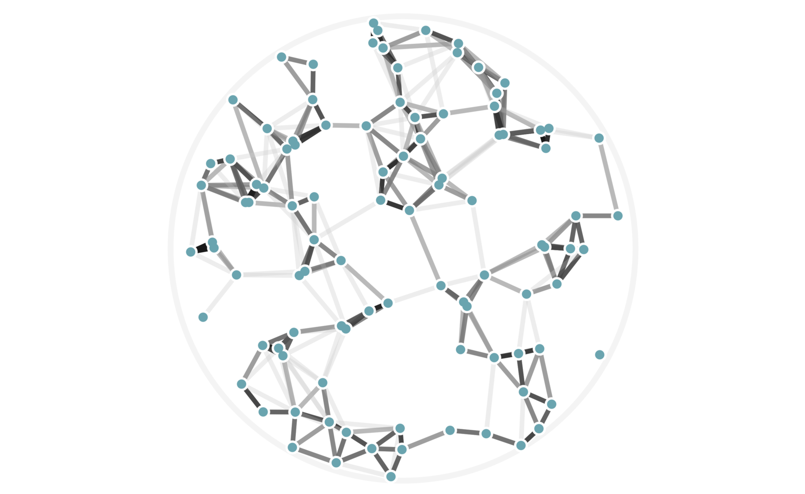
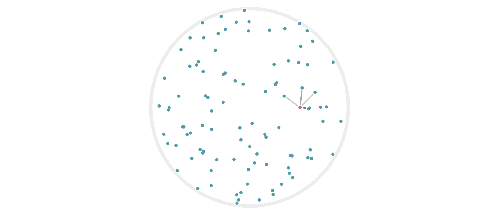

% Introduction to Locality-Sensitive Hashes
% Tyler Neylon
% 145.2018

CHECK:

* Update images to all use unitRadius = 2 (or consider it)
* I think figure 4 only has 3 hashes and the text says 4
  Try updating it to really have 4 hashes, but I can fall back to
  3 if 4 looks bad.
* Search this file for all instances of CHECK, IMAGE, XXX
* Check that the two pdf versions look good, including cross-references
* Check that the references header has no number
* Try to nicify the images in the pdf files
* Ensure that all references to figures in the text are done
  by mentioning a figure number.
* Follow-up ideas (put these somewhere centralized with other Unbox post ideas)
  + MinHash
  + ProxHash
  + The J-L Lemma

\newcommand{\R}{\mathbb{R}}
\newcommand{\Z}{\mathbb{Z}}
\newcommand{\eqnset}[1]{\left.\mbox{$#1$}\;\;\right\rbrace\class{postbrace}{ }}
\providecommand{\optquad}{\class{optquad}{}}
\providecommand{\smallscrneg}{\class{smallscrneg}{ }}
\providecommand{\bigscr}[1]{\class{bigscr}{#1}}
\providecommand{\smallscr}[1]{\class{smallscr}{#1}}
\providecommand{\smallscrskip}[1]{\class{smallscrskip}{\hskip #1}}

*Locality-sensitive hashes* are techniques that dramatically
speed up search-for-neighbors or near-duplication detection on data.
They can be used, for example, to filter out duplicates of scraped
web pages at an impressive speed, or to 
perform near-constant-time lookups of nearby points from a
geospatial data set.

When you think about hash functions, you might think about *hash tables*,
which is perhaps the most common use case. As a reminder, the hash
functions used in a hash table are designed to map a data structure to
an integer that can be used to look in a particular *bucket* within the
hash table to retrieve (or delete) that element. Common containers 
with string keys like
JavaScript object attributes and Python dictionaries are based on
hash tables.
Although they might not *guarantee* constant-time lookups, in practice they
effectively provide them.
Hash functions used for hash tables are called *universal hash functions*.
[CHECK]

There are a number of other classes of hash functions as well.
For example the SHA1 cryptographic hash function is designed to be
*difficult to reverse*, which is useful if you want to store someone's
password as a hashed value. [CHECK]
Another security-oriented hash function is CHECK, which is actually
designed to be *expensive to compute*, as this can deter malicious
ne'er-do-wells from easily building large lookup tables to be able to reverse a
hash on more likely input values.
Hash functions like these are called
*secure hash functions*. [CHECK]

Here are what all these various hash functions have in common:

* They map a wide variety of input data types to discrete values.
* In practice, we care about whether or not two (or more) input values map to
  the same output (hashed) value.

Locality-sensitive hash (LSH) functions are specifically designed so that
collisions of the hash value are *more likely* given two input values that
are *close together*. Just as there are different implementations of
secure hash functions for different use cases, there are different
implementations of LSH functions for different data types and for different
definitions of being *close together*.
In this post, I'll give a brief overview of the key ideas, and take a look
at a toy example based on *random projections* of vectors into
lower-dimensional spaces.

# An example

It will probably be much easier to grasp the main idea with an example.
(The "toy example" for random projections will come later. This is like
a mini-toy example.)

Suppose you have a million people from across the United States all standing
in a huge room. It's your job to get people who live close together to
stand together in groups. Imagine how much time it would take to walk up to
each person, ask for their street address, map that to a lat/long pair, then
write some code to find reasonable geographic clusters, and walk up to every
person again and tell them their cluster number. It's a disaster.

Here's a much better way to solve this problem: Write every U.S. zip code
on poster boards, and hang those from the ceiling. Then announce to everyone
to go stand under the zip code where they live.

Voila! That's much easier, right? The main idea here is also the main idea
behind locality-sensitive hashes. We're taking an arbitrary data type (a person,
who we could of as a ton of data including their street address), and mapping
that data into a set of discrete values (zip codes) such that 
people who live close together probably hash to the same value.
In other words, the clusters are very likely to be groups of neighbors.

The distinction between walking sequentially up to each person versus
parallelizing the work by asking everyone to find their own way to their zip
code was not an accident. Besides avoiding whatever clustering algorithm
you'd have to run on lat/long coordinates, another advantage of this hashing
approach is that it's extremely friendly to parallel processing. Despite caring
about *relationships* within your data, you can still split up the data any
way you like and compute the hashes in a fully parallelized fashion.

Another property of this example is that it is *approximate* in the sense
that some people may live across the street from each other, but happen to
cross a zip code line, in which case they would not be clustered together here.
As we'll see below, it's also possible for data points to be clustered together
even when they're very far apart, although a well-designed LSH can at least
give some mathematical evidence that this will be a rare event, and some
implementations manage to guarantee certain bad cases (such as clustering
of very far points or non-clustering of very close points) never happen.

# Hashing points via projection

Let's start with an incredibly simple mathematical function that we can
treat as an LSH. Define $f:\R^2 \to \Z$ for a point $x\in\R^2$ by

$$ f(x) := \lfloor x_1 \rfloor; $$

that is $f(x)$ is the largest integer $a$ for which $a\le x_1.$
(For example, $f((3.2, -1.2)) = 3.$)

Let's suppose we choose points at random by uniformly sampling from
the origin-centered circle $\mathcal C$ with radius 3:

$$ \mathcal C := \{ (x, y) : x^2 + y^2 \le 3^2 \}. $$

If we want to find which of our points in $\mathcal C$ are close together,
we can estimate this relationship by clustering together points $a$ and
$b \in \mathcal C$
iff (if and only if) $f(a) = f(b).$
It will be handy to introduce the notation $a \sim b$ to indicate that
$a$ and $b$ are in the same cluster. With that notation, we can write
our current hash setup as

$$ a \sim b \iff h_1(a) = h_1(b). $$

[@Fig:fig1] shows an example of such a clustering.

{#fig:fig1}

You can immediately see that some points are far apart yet clustered,
while others are relatively close yet unclustered.
There's also a sense that this particular hash function $h_1$ was
arbitrarily chosen to focus on the x-axis. What would have happened with
the same data if we had used instead
$h_2(x) := \lfloor x_2 \rfloor?$
The result is [@fig:fig2].

{#fig:fig2}

While neither clustering alone is amazing, things start to work better
if we use both of them simultaneously. That is, we can redefine our
clustering via

$$ a \sim b \iff h_1(a) = h_1(b) \text{ and } h_2(a) = h_2(b). $$ {#eq:eq1}

Our same example points are shown under this new clustering in
[@fig:fig3].

{#fig:fig3}

This does a much better job of avoiding clusters with points far apart,
although, as we'll see below, we can still make some improvements.

## Randomizing our hashes

So far we've defined deterministic hash functions. Let's change that
by choosing a random rotation matrix $U$ (a rotation around the origin)
along with a random offset $b \in [0, 1).$
Given such a random $U$ and $b,$ we could define a new hash function via

$$ h(x) := \lfloor (Ux)_1 + b \rfloor, $$

where I'm using the notation $( \textit{vec} )_1$ to indicate the first
coordinate of the vector value *vec* (that is, the notation
$(Ux)_1$ means the first coordinate of the vector $Ux$).

It may seem a tad arbitrary to use only the first coordinate here rather than
any other, but the fact that we're taking a random rotation first means that
we have the same set of possibilities, with the same probability distribution,
as we would when pulling out any other single coordinate value.

The advantage of using randomized hash functions is that any theoretical
properties we want to discuss will apply without having to worry about
pathologically weird data. Conceptually, if we were using deterministic hash
functions, then someone could choose the worst-case data for our hash function,
and we'd be stuck with that poor performance (for example, choosing
maximally-far apart points that are still clustered together by our $h_1$
function above). By using randomly chosen hash functions, we can ensure that
any average-case behavior of our hash functions applies equally well to
*all data*. This same perspective is useful for hash tables in the
form of *universal hashing*; if randomized hash functions are a new idea for
you, I recommend checking out [Wikipedia's universal hashing
page](https://en.wikipedia.org/wiki/Universal_hashing).

Let's revisit the example points we used above, but now apply some randomized
hash functions. In figure CHECK, points are clustered iff both of their
hash values (from $h_1()$ and $h_2()$) collide. We'll use that same idea, but
this time choose four rotations $U_1, \ldots, U_4$ as well as four
offsets $b_1, \ldots, b_4$ to define $h_1(), \ldots, h_4()$
via

$$ h_i(x) := \lfloor (U_i x)_1 + b_i \rfloor. $$ {#eq:eq3}

[@Fig:fig4] shows the resulting clustering. This time, there are 100 points
since using more hash functions has effectively made the cluster areas
smaller (so we need higher point density to see points that are
clustered together now).

![One hundred random points clustered using four random hash
functions as defined by ([@eq:eq3]). Points have the same color when
all four of their hash values are the same.
Each set of parallel light gray lines delineates the regions with the
same hash value for each of the $h_i()$ functions.](images/lsh_image4.png){#fig:fig4} 

It's not obvious that we actually want to use all four of our hash functions.
The issue is that our clusters have become quite small. There are a couple
ways to address this. One is to simply increase the scale of the hash
functions; for example:

$$ \tilde h_i(x) := h_i(x/s), $$

where $s$ is a scale factor (larger $s$ values will result in larger clusters).

However, there is something a bit more nuanced we can look at, which is to
allow some adaptability in terms of *how many hash collisions we require*.
In other words, suppose we have $k$ total hash functions (just above, we had
$k=4$). Instead of insisting that all $k$ hash values must match before we
say two points are in the same cluster, we could
look at cases where some number $j \le k$ of them matches. To state this
mathematically, we would rewrite equation ([@eq:eq1]) as

$$ a \sim b \iff \#\{i: h_i(a) = h_i(b)\} \ge j. $$ {#eq:eq2}

Something interesting happens here, which is that the $a \sim b$ relationship
is no longer a clustering, but becomes more like adjacency (that is, sharing
an edge) in a graph. The difference is that, in a clustering, if $a\sim b$ and
$b\sim c,$ the we must have $a\sim c$ as well; this is called being
*transitively closed*. Graphs don't need to have this property, and in our
case as well, it's no longer true that our similarity relationship is
transitively closed.

It may help your intuition to see this new definition of $a\sim b$ in action
on the same 100 points from [@fig:fig4]. This time ([@fig:fig5]) there are
twenty random hashes, and we're seeing the graphs generated by
([@eq:eq2]) using cutoff values (values of $j$) of 6, 7, 8, and 9.
In other words, the top-left graph in [@fig:fig5] has an edge drawn between
two points $a$ and $b$ whenever there are at least 6 hash functions $h_i()$
with $h_i(a) = h_i(b),$ out of a possible 20 used hash functions.

![A set of 100 random points with graph edges drawn according to
([@eq:eq2]). There are 20 random hash functions used. The top-left
graph uses the cutoff value $j=6.$
The remaining three graphs have cutoff values
$j=7,$ 8, and 9; this means each graph is a subgraph (having a subset
of the edges) of the previous one.](images/lsh_image5.png){#fig:fig5}

In fact, we can visualize all possible cutoff values (values of $j$ in
([@eq:eq2])) of 6 or higher in a single image by using weighted edges, like so:
CHECK finish that sentence; explain why we start at 6

Yet another fun way to get an intuitive feel for how much information we're
getting from our hashes is to see which subsets of our circle are matched ---
and to what degree --- by a given point:

IMAGE 8

[CHECK text on turning this into a graph]

## Why this is faster

So far we've been sticking to 2-dimensional data because that's easier to
visualize in an article. However, if you think about computing 10 hashes for
every 2-dimensional point in order to find neighbors, it may feel like
you're doing more work than the simple solution of a linear search through
your points. Let's review cases where using an LSH is more efficient than
other methods of finding nearby points.

### Zero linear search

If you have a huge number $n$ of points, and it's reasonable for you to
index those points ahead of time --- meaning, you can afford to compute
all $k$ hash values for each point --- then you can completely avoid the
linear-time cost of a brute force search for nearby points given a new
query point. This speed-up is relevant in any dimension, including the
simple 2-dimensional case.

### Fewer hashes needed in higher dimensions

Another effect that may be less obvious is that you can get away with
fewer hash values (a smaller $k$ value) in higher dimensions.
There are some mathematically sophisticated ways to quantify that statement,
but it may be even easier to understand graph based on empirically derived data.

Here's a summary of some random sampling I did in order to explore the
relationship between various values of $j$ for $d=100$ dimensional data using
$k=10$ different random hashes:      CHECK

IMAGE 9

CHECK the whole next paragraph
What's interesting here is that we get a relatively tight
box plot for $j$ values around CHECK. This means that we can choose the
threshold $j=CHECK$ in equation ([@eq:eq2]) and have fairly good confidence
that our hash-based "nearby" relationship closely matches reality.

We can even quantify this precisely. 
Although this article doesn't *prove* the following implications, the
empirical evidence found CHECK(add link to code) strongly suggests that these
are in fact the correct values:

$$ \text{dist}(a, b) > \alpha \Rightarrow P(\#\{i : h_i(a) = h_i(b)\} < j) > 0.95; $$

$$ \text{dist}(a, b) < \beta  \Rightarrow P(\#\{i : h_i(a) = h_i(b)\} \ge j) < 0.05. $$

CHECK(the actual identities may end up being based on the left side
      using a $j$ value rather than a distance to start with).

We might interpret these last two expressions as saying that 
we believe at least 99% of our pairwise relationships are correctly
classified. And we're able to do so while saving about
$O(n)$ speed.

## Other data types and approaches

This article has focused on numeric, 2-dimensional data
because it's easier to visualize. Locality-sensitive hashes can certainly
be used for many other data types, including strings, sets, or high-dimensional
vectors.

There are also other ways to specifically measure the performance of a
particular hashing approach. For example, CHECK.

Yet another ingredient to throw into the mix here are techniques to boost
performance which can treat any LSH as a black box. My favorite approach here
is to simply perform multiple lookups on a hash system, each time using
$q + \varepsilon$ as an input, where $q$ is your query value, and
$\varepsilon$ is a random variable centered at zero.
CHECK(add a bit about what this achieves; add a reference for it)

There's a lot more that can be said about LSH techniques.
If there is reader interest, I may write a follow-up article explaining
the details of min-wise hashing, which is a fun case that's simultaneously
good at quickly finding nearby sets as well as nearby strings.

CHECK ensure that the references section is not numbered

---

# References
