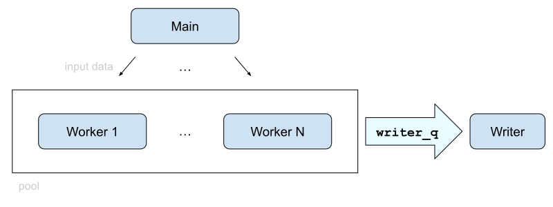
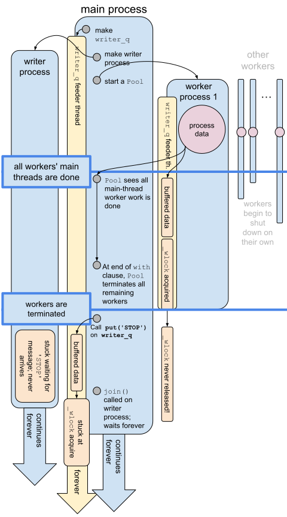

% Post Mortem of a Sneaky Bug Whilst Using Python Multiprocessing
% Tyler Neylon
% 25.2023

\newcommand{\R}{\mathbb{R}}
\newcommand{\N}{\mathbb{N}}
\newcommand{\eqnset}[1]{\left.\mbox{$#1$}\;\;\right\rbrace\class{postbrace}{ }}
\providecommand{\latexonlyrule}[3][]{}
\providecommand{\optquad}{\class{optquad}{}}
\providecommand{\smallscrneg}{\class{smallscrneg}{ }}
\providecommand{\bigscr}[1]{\class{bigscr}{#1}}
\providecommand{\smallscr}[1]{\class{smallscr}{#1}}
\providecommand{\smallscrskip}[1]{\class{smallscrskip}{\hskip #1}}

\newcommand{\mydots}{{\cdot}\kern -0.1pt{\cdot}\kern -0.1pt{\cdot}}

\newcommand{\?}{\stackrel{?}{=}}
\newcommand{\sign}{\textsf{sign}}
\newcommand{\order}{\textsf{order}}
\newcommand{\flips}{\textsf{flips}}
\newcommand{\samecycles}{\textsf{same$\\\_$cycles}}
\newcommand{\canon}{\textsf{canon}}
\newcommand{\cs}{\mathsf{cs}}
\newcommand{\dist}{\mathsf{dist}}
\renewcommand{\theenumi}{(\roman{enumi})}

[
Formats:
 [html](http://tylerneylon.com/a/py_bug_analysis/py_bug_analysis.html) |
 [pdf](http://tylerneylon.com/a/py_bug_analysis/py_bug_analysis.pdf)
 $\,$
]

While working on a prototype machine learning system in Python (v3.10.6), I hit
a concurrency deadlock that seemed at first to be impossible. This is the story
of that bug.

# The Architecture

The problem I'm solving involves iterating over more data than can fit into
memory, doing some non-trivial processing of each data item — call this step 1 —
and then integrating those outputs together in a non-trivial way — call this
step 2. Both memory and cpu cycles are potential bottlenecks.

I could shape the system in different ways, but I'm trying out an architecture
where a pool of worker processes does step 1, which is cpu-bound, and then uses
a shared queue to send its data to another process to do step 2, integrating the
output together. This is inspired by the actor model of handling concurrency:
Basically, there is no shared memory outside of message passing, which is done
by process-safe queues.

Here's the process and data flow layout:



Here's some pseudocode to capture this architecture, with the
[Queue in blue]{color="blue"}
and
the
[Pool in orange]{color="orange"}:

<div class="box"> \boxedstart

```
{formatted}import multiprocessing as mp

[# Load the data.]{bold}
a_giant_list = read_input()

[# Set up the writer process and queue.]{bold}
[writer_q]{color="blue"} = mp.Queue()
def writer_fn():
    global [writer_q]{color="blue"}
    # Process each message in the queue, stopping when
    # we receive a message == 'STOP'.
    for msg in iter([writer_q]{color="blue"}.get, 'STOP'):
        write_msg_into_data(msg)
writer_process = mp.Process(target=writer_fn)
writer_process.start()

[# Process the data.]{bold}
with mp.Pool(num_cores) as [p]{color="orange"}:
    # The function process_one_input() takes an input
    # datum and puts the processed output to writer_q.
    [p]{color="orange"}.map(process_one_input, a_giant_list)

[# Before we use the result, ensure the queues are done.]{bold}
[writer_q]{color="blue"}.put('STOP')
writer_process.join()
```

\boxedend </div>

That's pretty close to the actual code I was running, leaving out extraneous
code.

Hint 1: If you deeply grok Python's multiprocessing module, then the above is
enough information for you to see the bug.

Hint 2: Otherwise, I suspect you can't figure it out by looking at that code. It
is, in my opinion, not a simple typo or silly mistake. For example, sharing
`writer_q` as a global is legitimate.

# What Wasn't Working

Sometimes the code would work as intended, and other times — often — it froze on
the last line:


<div class="box"> \boxedstart

```
writer_process.join()
```

\boxedend </div>

# Investigating the Problem

I tried many things before fully understanding what was broken. I'll start by
listing the truly helpful steps I took, then explaining the source of the
problem, and finally — since I think this is also helpful to other coders — I'll
list other steps I took that turned out to be unnecessary, but might be helpful
in other situations.

## Helpful Steps

* **Use the source.**
  + You can read the source of a standard library module to help understand
    what's happening under the hood.
  + The `multiprocessing` module is internally made up of many source files —
    some of them in Python, and some in C. Luckily, I was able to learn most of
    what I needed without diving deeply into the C.
  + Here are two techniques you can use to find the location of your system's
    Python standard library:

<div class="box"> \boxedstart

```
# In your shell, print out locations where python finds
# library imports:

$ python3 -c 'import sys; print("\n".join(sys.path))'
```

(prints out a list of directories)

```
# One of those dirs, probably near the top of the list, contains
# your standard library files.
```

___

```
# In Python's REPL, see the location actually used for a
# particular module import:

$ python3 -v
```

(lots of output you can ignore)

```
>>> import multiprocessing

# /usr/lib/python3.10/multiprocessing/__pycache__/
__init__.cpython-310.pyc matches /usr/lib/python3.10/
multiprocessing/__init__.py
…

# The example above tells us my standard library is (mostly) at
# /usr/lib/python3.10/MODULE_NAME.
```

\boxedend </div>

* {+} I added some debug prints in the source to help understand exactly where
  the code was stuck.
  + To be a little bad, you can use *sudo* to edit your standard library files
    directly. Obviously this is a terrible idea (which I did); a more
    responsible thing to do is to work with a different siloed version of the
    standard library.

* **Print built-in logging messages from multiprocessing code.**
  + The multiprocessing module can provide some built-in debug messages that can
    help you see, at a high level (well, relative to low stuff) what's going on.
    You turn it on like this:

<div class="box"> \boxedstart

```
logger = mp.log_to_stderr()
logger.setLevel(logging.DEBUG)
```

\boxedend </div>

* {+} The docs for that are [here](https://docs.python.org/3/library/multiprocessing.html#logging).

* **Print when locks are acquired and released.**
  + Based on the nature of the problem — multiple processes, sometimes freezing,
    sometimes not — this looks like a race condition. A common type of race
    condition is when a lock can be held indefinitely.
  + By looking at the source of `multiprocessing.Queue`, I see that several locks
    are used, so it seems likely one of these is getting stuck.
  + Here’s one way to add debug prints each time a lock is acquired or
    released:

<div class="box"> \boxedstart

```
# In synchronize.py, edit the _make_methods()
# method of class Lock like so:

def _make_methods(self):

	def dbg_acquire(blocking=True, timeout=None):
		res = self._semlock.acquire(blocking, timeout)
		if res:
			print('Lock acquired')
		return res

	self.acquire = dbg_acquire

	def dbg_release():
		self._semlock.release()
		print('Lock released')

	self.release = dbg_release
```

\boxedend </div>

* {+} If you only had a single lock in your program, then you could look through
  the above prints to confirm that `acquire()` was called twice with no
  `release()` in between. That alone is not deadly, but if neither locker ever
  releases, then it becomes a mortal embrace.

  + There are a few things to improve from this setup:
    - I have many locks, so **I have too many debug prints**.
      I'll explain how to focus on a single lock next.
    - So far, these will let me confirm that a particular lock appears to be the
      deadlock source, but **it won't tell me *why* the deadlock happened**.
      I need more information to understand why; I'll add stack traces below to
      help with that.
    - Finally, **there can be missing debug prints**.
      That is, it's possible that a
      lock is released or acquired, but that the debug print never happens, such
      as if the process becomes stuck or killed after the acquire/release but
      before the print. In fact, I think I saw this happen in one of my test runs,
      and it was extremely confusing. I chose to ignore it as an anomaly, and
      later realized this was the likely cause. I don't think there's an easy fix
      for this. Basically, it's good to know that it might happen in rare cases.
      For the sake of debugging, I'd suggest running things multiple times so you
      don't get hung up on missing debug prints.

* **Print acquire/release updates only for a single lock.**
  + At first I started to do this by adding a new constructor argument to `Queue`
    and `Lock` that would turn on debug prints. This would be a nice general
    solution, but I was aiming for quick and effective rather than a gold medal
    for clean code. So I copied-and-pasted all of classes `Lock` and `Queue` into
    `Lock2` and `Queue2`, and added the debug code only to those new classes.
  + I then made only my `writer_q` queue an instance of `Queue2`. Within that, I
    looked at different locks and found the deadlock to occur on a lock it calls
    `self._wlock`. So that particular lock was the *only* instance of `Lock2` in my
    code.
  + The `multiprocessing` module actually uses factory functions to create
    instances of many of its classes, so you need to do more than add
    declarations for class `Lock2` in *synchronize.py*. You also need to add the
    appropriate methods to the `BaseContext` class in *context.py*, like this:

<div class="box"> \boxedstart

```
def Lock2(self):
	'''Returns a non-recursive lock object'''
	from .synchronize import Lock2
	return Lock2(ctx=self.get_context())
```

\boxedend </div>

* **Print process, thread, and stack trace information at will.**
  + From the above, I was able to gather strong evidence that `Queue`'s `_wlock`
    lock was being double-booked. It was easy to see why the 2nd acquisition was
    locking — the code would freeze, I can hit ctrl-C and see a stack trace.
  + (I'll explain the details of the freeze in the next section, "The Source of
    the Problem.")
  + In order to understand why the penultimate acquisition was happening (and
    from there to hopefully understand why it was not released), I printed out
    process and thread status with each lock acquisition.
  + Here is how to do that:

<div class="box"> \boxedstart

Print out the stack trace of any thread, such as the current thread:

    frames = sys._current_frames()
    thread = threading.current_thread()
    stack = ''.join(traceback.format_stack(frames[thread.ident]))
    print(stack)

The above idiom can be extended to print out stack traces for other threads; in
fact, the main use case for `sys._current_frames()` is to enable you to do so even
in a deadlock situation. Here's a quote from the
[sys docs for `_current_frames()`](https://docs.python.org/3/library/sys.html#sys._current_frames):

> "This is most useful for debugging deadlock: this function does not require the
> deadlocked threads’ cooperation, and such threads’ call stacks are frozen for as
> long as they remain deadlocked. The frame returned for a non-deadlocked thread
> may bear no relationship to that thread’s current activity by the time calling
> code examines the frame."

For the record, here's a simpler way to print out the current stack trace:

    traceback.print_stack()

\boxedend </div>

<div class="box"> \boxedstart

Print out a list of all threads in the current process, and their stacks:

    frames = sys._current_frames()
    for thread in threading.enumerate():
        print(thread.name)
        if thread.ident in frames:
            traceback.print_stack(frames[thread.ident])

\boxedend </div>


<div class="box"> \boxedstart

Print out the name / identifier / pid for the current process and thread.

In this example, I'll also show one way to package up multiple strings into a
single print. This is useful to reduce the likelihood of prints overlapping each
other across different processes.

```
{formatted}frames = sys._current_frames()
thread = threading.current_thread()
stack = ''.join(traceback.format_stack(frames[thread.ident]))
# inspect.cleandoc() trims some whitespace for you.
msg = [inspect.cleandoc]{url="https://docs.python.org/3/library/inspect.html#inspect.cleandoc"}(f'''
    Lock acquired
    {[process.current_process()]{bold}} pid={[os.getpid()]{bold}}
    {[threading.current_thread()]{bold}}
    Stack:
    {stack}
''')
print(msg, flush=True)

# Note that I'm calling process.current_process() above since
# I'm within the multiprocessing source; outside of it, you'd
# call multiprocessing.current_process() instead.
```

It's useful to include `flush=True` because when you redirect to a file, flushing
is not automatic. Without the flush, you might end up seeing a side effect that
happened *after* a debug print line, but never seeing that debug print in your
output.

\boxedend </div>

* **Use a timeout-based hook to auto-print more info.**
  + Often, when someone makes an indefinitely-blocking call to
    `Lock.acquire()`,
    you expect the lock to be acquired quickly. If it's not acquired after, say,
    2 full seconds, that might indicate something's gone
    sideways.
  + All of the above can produce many printouts, so it's nice to have an
    automatic hook that executes at the point when things are deadlocked.
  + We can do this by hooking into the `dbg_acquire()` method on `Lock2`, as in
    the next example.


<div class="box"> \boxedstart

This example is from *queues.py*, in the `_feed()` method, which I'll explain
further below.

I replaced the single line:

    wacquire()

with this:
 
    if not wacquire(True, 2):  # Try to lock, timeout after 2sec.
        # Debug prints.
        print('I appear to be stuck.')
        print('Threads:')
        frames = sys._current_frames()
        for thread in threading.enumerate():
            print(thread.name)
            if thread.ident in frames:
                traceback.print_stack(frames[thread.ident])
        wacquire()

\boxedend </div>

* **Check which processes are alive.**
  + At this point in the debugging, I was pretty sure that one of my pool's
    workers was dying quite violently, and taking our precious `_wlock` with it
    to its grave. I wanted to confirm this suspicion by checking that a
    given process had first acquired the lock and then died without releasing
    it.
  + I thought about programmatically getting the appropriate `Process` object in
    Python, but then I realized it would be easier to just print out the pid
    with the lock, and use *pgrep* to see if the pid was alive at a given point.
    Like this:


<div class="box"> \boxedstart

`$ python3 my_program.py`\
… it freezes; I can see any pids that hold the lock
via debug prints from the steps above.

Me, in another shell:\
`$ pgrep python`\
… list of living Python pids. If a dead (missing) pid holds the lock, that
causes a deadlock.

\boxedend </div>

* {+} It worked! My suspicions were confirmed.
  + Now I can tell you how things were breaking.

## The Source of the Problem

Internally, Python's multiprocess queues rely on os-level pipes for
communication. A pipe is a FIFO (first-in, first-out) buffer of bytes. When two
processes have the same pipe open, either one can write bytes into it, or read
bytes out of it. It‘s already similar to a queue, except that:

* The application itself must wrap and unwrap messages since the os sees the
  pipe as just a sequence of bytes; there are no built-in message delimiters.
* Pipes have a limited capacity, typically something like 64KiB. This is
  small enough that it often makes sense to add code on either end of the pipe
  to deal with either many messages, or large messages.

In particular, `multiprocessing.Queue` supports many `put()` calls by including
a process-local buffer before data reaches the pipe. Every time a Queue instance
arrives in a new process, it creates a thread called a feeder thread in that
process. When you call `Queue.put()`, your message goes into the process-local
buffer before hitting the pipe; it works this way so that `put()` calls never
block, even if the pipe is full. It's the feeder thread's job to asynchronously
move data out of the process-local buffer and put that into the pipe according
to the pipe’s capacity.

The feeder thread is smart enough to use a write lock on the pipe. This way, no
two messages will be interwoven and thus mangled if two processes execute a
`put()` at the same time.

The Queue implementation is also smart enough to flush the process-local buffer
into the pipe when any process undergoes a normal shutdown process. Essentially,
when the process-local copy of a Queue is garbage collected, it waits for the
feeder thread to empty the process-local buffer. This ensures that (a) no data
is lost, and (b) the locks don't end up in a broken state.

So far, so good, right? What can go wrong?

Well, the problem is in the combination of:

#. A `Queue` that depends on clean process shutdown, along with
#. a `Pool` that is
#. managed by a `with` statement.

A `multiprocessing.Pool` object is normally quite friendly to its workers.
However, it turns out that when you manage the lifetime of a pool via the `with`
statement, the workers will be terminated with prejudice. That is, killed
without a chance to clean themselves up.

So a worker can acquire `_wlock`, be unceremoniously killed, and then the
next thread that wants to acquire `_wlock` is stuck. In my case, the feeder thread
is stuck when I call `writer_q.put('STOP')`. The `'STOP'` message never gets
through, but I don't see any bad behavior unless I try to join the writer
process, which never completes as it's waiting forlornly for its long-lost
sentinel signal (the `'STOP'` message).

The timeline looks like this:



As a list of events, the deadlock occurs like this:

* I create the `writer_q` Queue.
* I create the Pool, which creates worker processes.
* Each worker process has a local copy of `writer_q`, which creates its own feeder
  thread.
* The workers call `writer_q.put()` many times, and that data passes through the
  local queue buffer.
* The main thread of execution on each work threads completes.
* The `with` clause that contains the scope of the Pool ends, so
  `Pool.__exit__()` is called.
* The Pool terminates all remaining worker processes.
* If any of those workers are killed while holding the write lock (`_wlock`) of
  `writer_q,` the queue is now stuck. But there's no deadlock quite yet because
  nothing is waiting yet.
* Meanwhile, back in the main process, I call `writer_q.put('STOP')` so I can wait
  for the writer process to complete. This does not block on the main thread
  because the main thread never acquires `_wlock`. Only the feeder thread ever
  holds `_wlock`.
* However, the feeder thread in the main process becomes stuck as soon as it
  tries to transfer `'STOP'` into the pipe. It can't acquire the `_wlock` because
  it's still locked by the dead worker.
* The writer process keeps chugging away in its `for iter(writer_q.get, 'STOP')`
  loop, never getting the message.
* The main thread is now also stuck waiting for the writer process to stop.

That's the whole bug. I'll explain in a minute how I decided to fix it.

## Unnecessary but Interesting Steps

Before explaining the fix, I wanted to give some tips for building cpython from
source. Why? Well, at one point I thought I'd have to debug at the C level, so I
took that red pill temporarily. It turns out, I didn't really need to do that,
but it was easier than I had expected. And kind of fun.

Here are some tips if you'd like to build cpython from source on ubuntu, which
is the platform I've been using:


<div class="box"> \boxedstart

**Build from source.**

___

Find the version you want and download the gzipped tarball from cpython's github
tags page.

```
# For example, this would work in a dedicated directory:

$ wget https://github.com/python/cpython/archive/refs/tags/v3.10.6.tar.gz
$ gunzip *.gz
$ tar xvf *
$ cd cpython<hit_tab>
$ ./configure
$ make
```

That's actually enough already to build from source. To run your freshly baked
interpreter, do this:

    $ ./python

\boxedend </div>


<div class="box"> \boxedstart

**Remind yourself you're using an edited version of Python.**

___

I highly recommend editing *Programs/python.c* by inserting the following line
at the start of `main()`:

    printf("narf\n");

This will ensure that you are constantly reminded that you're running your own
personal narfed version of *cpython* every time you run. Please be sure to
spell "narf" correctly; otherwise you may be confused by a clearly misspelled
nonsense word.

\boxedend </div>


<div class="box"> \boxedstart

**Get the ffi and openssl libraries linked in.**

___

```
# For some reasons, my run of ./configure did not find these
# on my box. I fixed this like so:

$ sudo apt-get install libffi-dev
$ sudo apt-get install libssl-dev
$ ./configure
$ make
```

\boxedend </div>

<div class="box"> \boxedstart

**Get pip up and running.**

___

I didn't get pip with my wget from github. Go figure. But it's not too hard to
get:

    $ ./python -m ensurepip

From there you can run:

    $ ./python -m pip install whatever

Have fun!

\boxedend </div>

# Fixing the Problem

## Non-Solutions

**Cleanup Messages**

At first, I tried to modify my mapper function, which runs on the workers, so
that it would recognize a special message to flush the feeder thread. If all
workers flushed their feeder exhaust ports before expiring, then none of the
workers would try to acquire `_wlock` when the pool decided to become the
terminator.

However, this is not a great idea. Why not? Because pool does not distribute
tasks in a round-robin fashion. And it shouldn't really, because you basically
want to always have all cores busy for as long as possible — so it makes sense
to let workers take tasks on a first-come first-serve basis. When I implemented
this, some workers would get two cleanup messages, and some got none.

**Other Queue Types**

I also thought about using one of the other Queue types provided by
multiprocessing: `SimpleQueue`, which has no buffer; or `JoinableQueue`, which
supports feedback to a message producer than messages have been completely
processed (not just received).

Both of these are non-starters because they don't solve the fundamental problem:
As soon as you rely on a lock, you can't dance with processes that are
terminated. And all of these queue types have at least one lock.

## A Two-Line Fix

The fix is almost painfully simple:

<div class="box"> \boxedstart

Instead of this:

```
with mp.Pool(num_cores) as p:
    p.map(process_one_input, a_giant_list)
```

do this:

```
{formatted}with mp.Pool(num_cores) as p:
    p.map(process_one_input, a_giant_list)
    [p.close()]{bold}
    [p.join()]{bold}
```

\boxedend </div>

Calling `p.join()` gives all workers the time to get their affairs in order
before their demise. We only call `p.close()` first because the class requires
this before we can `join()`.

Another alternative is to simply avoid using a `with` clause. However, if
there's a reasonable way for me to use `with` clauses, I prefer them because
it's an unmissable cue to future developers that there is some context here
which we probably want to ensure is cleaned up.

A subtle consequence of this design is that, if an exception is raised by the
`p.map()` call, then the workers may still be terminated. In my case, exceptions
mean we should stop the program; but it's good to keep in mind this possible
issue for other applications.

# Hints in the Docs

To what degree was this bug my fault?
First, to give some credit to the developers of
multiprocessing, there is a relevant warning in the docs, which I'll include
below. Second, to be fair to myself, I don't see why terminating the workers is
the right behavior for `Pool.__exit__()`; it's surprising behavior to me which
is fundamentally incompatible with the design of the rest of the module. It
seems more natural for the end of a `with` clause to close and join the pool.
If `terminate()` is necessary, it can be called after joining.

Here's the warning from the
[docs for multiprocessing](https://docs.python.org/3/library/multiprocessing.html#:~:text=Avoid%20terminating%20processes):

<div class="box"> \boxedstart

Avoid terminating processes

> Using the `Process.terminate` method to stop a process is liable to cause any
> shared resources (such as locks, semaphores, pipes and queues) currently being
> used by the process to become broken or unavailable to other
> processes.
> 
> Therefore it is probably best to only consider using `Process.terminate` on
> processes which never use any shared resources.

\boxedend </div>

# How can I help other developers?

I don't usually write up post mortems like this — otherwise I wouldn't get much
done! But this was a fun bug, and I learned enough while debugging that I wanted
to take notes and share these with other coder friends.

The notes above cover tactical tips, like flushing your prints immediately to
promote accurate logs, but I also have a small collection of higher-level
strategic considerations.

Concurrency debugging suggestions from myself and friends:

* Tips I like:
  + **[Be methodical]** It's easy to get lost in the weeds. Write down questions that will help you understand the problem, being thoughtful and deliberate about your strategy to isolate the problem. If this will be production code, avoid the temptation to say "good enough" if it seems fixed but you don't know why. If it's throw-away code, avoid the temptation to spend too much time debugging when you don't really need to.
  + **[Decouple and learn]** Some quick stack traces are likely to give you hints as to which objects are not working correctly. Try to decouple the critical code objects early on, and understand how those handle concurrency in depth. If the behavior is hard to decouple, this is likely to be a design flaw that you can fix before debugging the rest.
* Tips from Scott Cameron:
  + **[Break it more]** If you have a guess about the problem, try to make it worse (such as making it break sooner / more often when non-deterministic). This gives you empirical evidence to support / refute your guess.
  + **[Think]** Just sit there and think hard. Concurrency bugs are a case where you may get more return-on-investment for staring at code and thinking rather than trying-and-seeing.
  + **[Remove safety checks]** This one sounds bananas, but bear with me. The idea here is that often fancy or clever devices designed to simplify your life by hiding complexity are actually the things introducing the problem. In my case, this was more-or-less true, since I was using a `with` clause that was partially the source of my bug. In other words, simplify and reduce magic.
* A tip from Joël Franusic:
  + **[Use Go]** Use Go.


