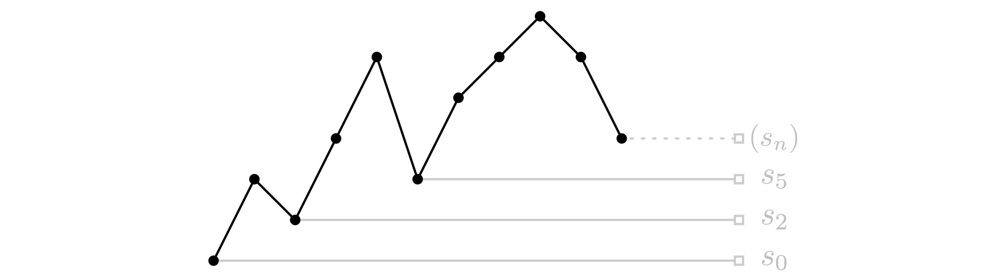

% Notes on Raney's Lemmas
% Tyler Neylon
% 251.2015

In a 1960 paper, George Raney proved
the first two lemmas below; the lemmas suppose we have a
finite sequence of numbers meeting certain constraints, and
provide the number of cycle shifts that contain
all-positive partial sums [@raney].

These notes expand on the ideas behind these lemmas.
The final section of these notes discusses cyclic shifts for
finite sequences of independent, uniformly random
values; as far as I know, the work in that section is new.

I personally learned of these lemmas in chapter 7 of
the book *Concrete Mathematics* [@concrete],
which explores their applications to generating functions.
The presentation of the lemmas here is based on the
presentation in *Concrete Mathematics* rather than on
Raney's original paper.

# Integer sequences

**Lemma 1**\ 
*Suppose $\sum_{i=1}^n x_i = 1$, where all $x_i\in\mathbb{Z}$.
Extend the sequence by letting $x_{n+p}=x_p$ for $1\le p\le n$.
Then there is a unique $j$, $1 \le j \le n$, such that*

$$\sum_{i=j}^{j+k-1} x_i > 0; \quad 1 \le k \le n.$$

---

Intuitively, we can think of such an index $j$ as a cyclic shift
of the sequence that has partial sums that are all positive.

For example, the finite sequence
$\langle x_1, \ldots, x_5\rangle = \langle 3, -2, 4, -1, 1 \rangle$
offers $j=5$ as the unique shift providing
$\langle x_5, x_6=x_1, \ldots, x_9=x_4\rangle = \langle 1, 3, -2, 4, -5\rangle$
with partial sums
$\langle 1, 4, 2, 6, 1\rangle$ that are all positive.

**Definitions**\ 
Given a sequence $\langle x_1, \ldots, x_n\rangle$, it's useful to say that
an index $i \in \{1,\ldots, n\}$ is a *positive-sum shift* if and only if
the partial sums of $\langle x_i, \ldots, x_n, x_1, \ldots, x_{i-1}\rangle$
are all positive. Since these notes focus on finite sequences, we'll
implicitly use arbitrary indexes $x_j, j\in\mathbb{Z}$, to refer to
$x_k$ with $k\in \{1, \ldots, n\}, k\equiv j \pmod n$.

We'll use the subscript-free letter $x$ to denote an entire finite sequence
$\langle x_1, \ldots, x_n\rangle$. We'll write $\sigma(x)$ to indicate the
number of indexes of $x$ that are positive-sum shifts.

We can now concisely state a related result proved by Raney:

**Lemma 2**\ 
*Suppose $\sum_{i=1}^nx_i=\ell$, where $x_i\in\mathbb{Z}$ and
$x_i \le 1$ for all $i$.
Then $\sigma(x) = \ell$; that is,
exactly $\ell$ indexes in $\{1, \ldots, n\}$ are
positive-sum shifts.*

---

For example, let $\langle x_1, \ldots, x_8\rangle =
\langle -2, 1, 1, 0, -1, 1, 1, 1\rangle$. Then
$\sum x_i = 2$, and $x_2, x_6$ are the only
positive-sum shifts:

 shift | partial sums
-------|----------------
$\langle x_2, \ldots\rangle = \langle 1, 1, 0, -1, 1, 1, 1, -2\rangle\quad$ | $\langle 1, 2, 2, 1, 2, 3, 4, 2\rangle$
$\langle x_6, \ldots\rangle = \langle 1, 1, 1, -2, 1, 1, 0, -1\rangle\quad$ | $\langle 1, 2, 3, 1, 2, 3, 3, 2\rangle$

Note that lemma 2 is not a strict generalization of lemma 1 as it adds the
condition $x_i \le 1$. This condition is necessary for lemma 2;
without it we may have, for example, the one-element sequence
$x = \langle 2\rangle$ with sum $\ell = 2$ and $\sigma(x) = 1$.

Rather than proving the above two lemmas directly, we'll jump to the
general case of real sequences $x$ and prove strictly more general bounds
on $\sigma(x)$ in that context.

# Real sequences

In a moment we'll prove a general guarantee that
$\sum x_i > 0 \Rightarrow \sigma(x) \ge 1$.
In the context of a sequence $x$,
it will be useful to write $s_i$ to denote the
$i^\mathrm{th}$ partial sum of $x$; that is, $s_0 = 0$, and
$$ s_i = \sum_{j=1}^i x_j, \quad \text{for } i \ge 1. $$
We can define $s_i$ for $i > n$ using the implicitly
periodic sequence characterized by $x_{n + i} = x_i$.

**Property 3**\ 
*Suppose $\sum_{i=1}^nx_i > 0$, where $x_i\in\mathbb{R}$.
Let $s_i$ denote the $i^\mathrm{th}$ partial sum of $x$, and
let $j$ be the largest index in $\{1, \ldots, n\}$ with $s_{j-1} = \min_{0\le i < n} s_i$.
Then $j$ is a positive-sum shift.*

---

**Proof**\ 
Let
$$s'_i = \sum_{k=j}^{j+i-1}x_k$$
denote the $i^\mathrm{th}$ partial sum of the shifted sequence
$\langle x_j, \ldots, x_{j+n-1}\rangle$.
Then, for $1 \le i \le n$,
$$s'_i = s_{j+i-1} - s_{j-1}
\begin{cases}
> 0 \text{ (by definition of $j$)} & \text{when } j+i-1 < n \\
= s_n + s_{j+i-1-n}-s_{j-1} \ge s_n > 0 & \text{when } j+i-1 \ge n. \\
\end{cases}$$
$\Box$

Now we can assume without loss of generality that any sequence of
real numbers $\langle x_1, \ldots, x_n\rangle$ with $\sum x_i > 0$
is already shifted
so that all its partial sums $s_i > 0$ for $i > 0$.
As we'll see in the next property, this assumption allows us
to provide a nice general expression for $\sigma(x)$.
This expression depends on the set
$S(x)$, defined as
$\{\min_{j \le i \le n} s_i\; \big|\; 1 \le j \le n \}$
for any finite sequence $x$ with $i^\text{th}$ partial sum $s_i$.

**Property 4**\ 
*Suppose that $x$ is a finite real sequence with $i^\text{th}$ partial sum
$s_i$, and that $s_i > 0$ for all $i > 0$. Then*

$$\sigma(x) = \#S(x) =
\#\left\{\min_{j \le i \le n} s_i\; \big|\; 1 \le j \le n \right\}.$$ {#eq:prop4pt1}

*More specifically, an index $j$ with $1 \le j \le n$ is a positive-sum shift iff*

$$s_{j-1} < s_i \;\forall i: j\le i \le n.$$ {#eq:prop4pt2}

---

**Proof**\ 
We'll start by supposing we have an index $j$ with $1 \le j \le n$ and
$s_{j-1} < s_i$ for all $i$ with $j \le i \le n$; our goal is to show that such
a $j$ must be a positive-sum shift. Our approach will be similar to the proof of
property 3.

Let $s'_i$ denote the $i^\text{th}$ partial sum of $\langle x_j, \ldots, x_{j+n-1}\rangle$:
$$s'_i = \sum_{k=j}^{j+i-1}x_k.$$
Then
$$s'_i = s_{j+i-1} - s_{j-1} \begin{cases}
> 0 & \text{if } j+i-1 \le n, \\
= s_{j+i-1-n} + s_n - s_{j-1} > 0 & \text{if } j+i-1 > n; \\
\end{cases}$$
the last inequality follows since $s_{j+i-1-n} > 0$ and $s_n > s_{j-1}$.

On the other hand, if $s_{j-1}\ge s_i$ for some $i,j$ with $1\le j\le i\le n$, then
$s'_{i-j+1}=s_i-s_{j-1}\le 0$, so that $j$ isn't a positive-sum shift.
This completes the proof of the last part of the property.

Now let's verify that the set $S = S(x)$
from (@eq:prop4pt1) has size $\sigma(x)$.

Let $j_1, \ldots, j_k$ be all the positive-sum shifts with $1 < j_i \le n$;
note that $k = \sigma(x) - 1$ since the trivial shift index 1 has been excluded.
Let $T = \{s_{j_1 - 1}, \ldots, s_{j_k - 1}, s_n\}$.

Notice that $j=n+1$ trivially meets condition (@eq:prop4pt2); combine this with
the first part of the proof to see that all elements of $T$ meet condition
(@eq:prop4pt2). This guarantees that all the elements are unique, so that
$|T| = \sigma(x)$.
This also means that $T \subset S$.
Finally, observe that, for any $s_j \in S$,
there's a largest index $j'$ with $1\le j' \le n$ and
$s_{j'} = s_j$; this index $j'$ meets
condition (@eq:prop4pt2), so that $S\subset T$, confirming that
$|S| = |T| = \sigma(x)$.
$\Box$

Property 4 lends itself to a nice visual intuition.
Consider the example sequence
$\langle 2, -1, 2, 2, -3, 2, 1, 1, -1, -2\rangle$ of
length $n=10$.
Below is the line graph of its partial sums, starting with $s_0=0$.

Imagine an observer standing far to the right of the graph and looking
directly to the left so they can only see along a perfectly horizontal line
of sight.
Below $s_n$, they can only see the three points $s_0$, $s_2$, and $s_5$.
These are exactly the partial sums meeting condition (@eq:prop4pt2), so
that they correspond directly to all the positive-sum shifts
of $x$, which have indexes 1, 3, and 6.

This visual intuition — that points visible-from-the-right and below
$s_n$ correspond exactly to the positive-sum shifts —  extends to
any sequence meeting the suppositions of property 4.

It's now possible to prove a simple general upper and lower bound
for $\sigma(x)$ in the case that each $x_i$ is an integer.
We'll see below that these bounds provide both lemmas 1 and 2 as
corollaries.

**Property 5**\ 
*Suppose we have a finite integer sequence
$x = \langle x_1, \ldots, x_n\rangle$ with
$s_n > 0$. Let $m = \max_i x_i$.
Then
$$
\lceil s_n / m \rceil \le \sigma(x) \le s_n.
$$*

**Proof idea**\ 
Here is the informal intuition behind the proof:
We'll start by noticing that, for sum-positive $x$,
$S(x) \subset (0, s_n]$; this is the basis used for the upper bound.
The lower bound is based on the idea that
each jump upwards from one $s_i\in S(x)$ to the next
$s_j\in S(x)$ is limited by distance $m$.
The smallest element in $S(x)$ can be at most $m$ above
$s_0=0$, and the largest is necessarily $s_n$, so that
there must be at least $s_n/m$ elements between the extremes.

**Proof**\ 
Notice that we can work with any cyclic shift $x'$
of $x$ without changing $s_n$ or $m$.
Thus, using property 3, we can assume without loss
of generality that
$s_i > 0$ for $i > 0$.

Next, we can bound the elements of $S(x)$ via
$$
0 < \min_{j\le i\le n}s_i \le s_n
$$
for all $j$ with
$1\le j \le n$.
So all elements of $S(x)$ are in
the range $(0, s_n]$, and are integers.
Hence
$\#S(x) \le s_n$, completing the proof of the upper bound.

Toward the lower bound, let's suppose that
$S(x) = \{s_{j_1}, \ldots, s_{j_k}\}$ with
each $s_{j_i}$ meeting condition (@eq:prop4pt2) and
$0 < s_{j_i} < s_{j_{i+1}}$.
We know such $s_{j_i}$ exist as they are simply those
partial sums in $s_{j_i}\in S(x)$ chosen so that 
$j_i = \max_{1\le k\le n} \{k: s_k = s_{j_i}\}$.

By our definition of $s_{j_i}$, we have
$$
s_{j_i} = \min_{j_i \le k \le n}s_k
\;\text{ and }\;
s_{j_{i+1}} = \min_{j_i+1 \le k \le n}s_k.
$$
This means that
$$s_{j_{i+1}} - s_{j_i} = \min_{j_i+1 \le k \le n}s_k - s_{j_i} \le
s_{j_i+1} - s_{j_i} \le
m.$$

Note that $s_{j_k}=s_n$ so that
$s_n - s_{j_{k-1}} \le m \Rightarrow
s_{j_{k-1}} \ge s_n - m$.
This can be extended to see that
$s_{j_{k-2}} \ge s_n - 2m$, and in general that
$$
s_{j_{k-p}} \ge s_n - pm.
$$

Our definition of $m$ gives us that $s_{j_1} \le m$, so
$m \ge s_{j_1} \ge s_n - (k-1)m$, from which we can
derive that
$$
1 \ge s_n/m - (k - 1)
\quad \Rightarrow \quad
k \ge s_n/m
\quad \Rightarrow \quad
k \ge \lceil s_n/m \rceil;
$$
the last inequality uses the fact that $k = \sigma(x)$ is an integer.
This completes the proof.
$\Box$

**The Contraction Perspective**

Next we'll consider a contraction operation that may shorten a sequence
$x$ while preserving $\sigma(x)$.

Call a sequence $x = \langle x_1, \ldots, x_n\rangle$
*sum-positive* iff $s_i > 0$ when $i > 0$.
We'll say that a sequence $x' = \langle x'_1, \ldots, x'_{n-1} \rangle$
is a *contraction* of the length-$n$ sum-positive sequence
$x$ iff there is some index $j$ so that $x_{j + 1} \le 0$ and,
for $1 \le i \le n-1$,
$$x'_i = \begin{cases}
x_i & \text{if } i < j, \\
x_i + x_{i + 1} & \text{if } i = j, \text{and} \\
x_{i + 1} & \text{if } i > j.
\end{cases}$$

For example. $x' = \langle 2, -1, 2\rangle$ is
a contraction of $x = \langle 3, -1, -1, 2\rangle$
since the sequences are same except for the replacement
of $x_1, x_2$ by their sum as $x'_1$, and $x_2 = -1 \le 0$.
The alternative sequence $x'' = \langle 3, -1, 1\rangle$
is *not* a contraction as it replaces $x_3, x_4$ with their sum
$x''_3$, but $x_4 = 2 > 0$.

**Property 6**\ 
*If $x'$ is a contraction of $x$, then $x'$ is sum-positive and
$\sigma(x') = \sigma(x)$.*

**Proof**\ 
Let $j$ be the contracted index, so that
$x'_j = x_j + x_{j + 1}$ and $x_{j + 1} \le 0$.

Let $s'_i$ denote the $i^\text{th}$ partial sum of $x'$.
Then
$$s'_i = \begin{cases}
s_i & \text{if } 0 \le i < j \\
s_{i + 1} & \text{if } j \le i \le n-1.
\end{cases}$$

So $s'_i > 0$ for $0 < i \le n - 1$, making $x'$
sum-positive.

Since $x_{j+1} \le 0$, $s_{j+1} \le s_j$.
This means that
$$
\min_{k \le i \le n} s_i = \min_{k \le i \le n, i \ne j} s_i,
\;\;\text{and}\;\;
\min_{k \le i \le n} s'_i = \begin{cases}
\min_{k \le i \le n} s_i & \text{if } k < j, \text{ and} \\
\min_{k+1 \le i \le n} s_i & \text{if } k \ge j,\\
\end{cases}
$$
for all $k$ with $1 \le k \le n$.
This last equality ensures that $S(x) = S(x')$, so that
$\sigma(x) = \sigma(x')$ using property 4.
This completes the proof.
$\Box$

As long as a sum-positive sequence $x$ has any element $x_i \le 0$, we
can apply a contraction to it to arrive at a shorter sequence.
Thus, we can always apply a series of contractions to arrive at
a sum-positive, length-$k$ sequence $x'$ with all elements $x'_i > 0$.
All shifts of this $x'$ are positive-sum shifts, so that $\sigma(x')=k$,
and thus $\sigma(x)=k$ as well. In other words, we can find
$\sigma(x)$ by contracting $x$ until it can be contracted no more.

To add both intuition and more detail to this process, think of any
sum-positive sequence $x$ as consisting of subsequences starting
with $x_j$ for each positive-sum shift index $j$. For example,
suppose sequence $x$ has positive-sum shift indexes 1, 3, and 4. Then
$$
\langle x_1, x_2, x_3, x_4, x_5, x_6\rangle =
\langle x_1, x_2\rangle
\langle x_3 \rangle
\langle x_4, x_5, x_6 \rangle.
$$

Contractions effectively work within these subsequences.
A contraction can never combine elements across a subsequence boundary
because the first element of any subsequence must be positive.
Our last proof showed that 
the set $S(x)$ is preserved by contraction. That proof
also showed that the indexes $j_1, \ldots, j_k$ with
$\{s_{j_1}, \ldots, s_{j_k}\} = S(x)$ are preserved as well, excepting
a possible shift-by-one in the latter elements to account for the
contraction. 
In other words, if an element $x_j$ begins a subsequence before a contraction,
then it will be mapped to $x'_k$ with either $k=j$ or $k=j-1$, with $x'_k = x_j$,
and with $x'_k$ also acting as a positive-sum shift for $x'$.

The final result of any maximal series of contractions is therefore deterministic:
we must arrive at exactly the sequence of sums of the original subsequences.
Using our last example sequence, we may make the following
series of underlined contractions:
$$
\begin{array}{cccc}
&
\langle x_1, x_2\rangle &
\langle x_3 \rangle &
\langle x_4, x_5, x_6 \rangle \\
\rightarrow &
\langle x_1, x_2\rangle &
\langle x_3 \rangle &
\langle \underline{x_4 + x_5}, x_6 \rangle \\
\rightarrow &
\langle \underline{x_1 + x_2}\rangle &
\langle x_3 \rangle &
\langle x_4 + x_5, x_6 \rangle \\
\rightarrow &
\langle x_1 + x_2\rangle &
\langle x_3 \rangle &
\langle x_4 + \underline{x_5 + x_6} \rangle. \\
\end{array}
$$

The final sequence has 3 positive elements, so we can't perform
any more contractions.
We have freedom in the order in which we execute those contractions,
but the end result is independent of this order.
Note that, although we've highlighted the subsequence structure here,
we don't need to be aware of that structure to execute the contractions.

# Random sequences

In this section, we'll consider a finite sequence
$s = \langle s_1, \ldots, s_n\rangle$ whose elements $s_i$ are
independent random variables, each uniformly distributed in the
interval $(0, 1]$. These are the partial sums of the
sequence $x_i = s_i - s_{i-1}$, $1 \le i \le n$, where we define $s_0 = 0$.
Generating $x$ in this manner ensures it is sum-positive.

This section focuses on the question: what is the expected value of $\sigma(x)$?

Notice that, if $i \ne j$, then $s_i \ne s_j$ with probability 1.
In the context of finding an expected value,
we can thus assume without loss of generality that we're
only considering sequences $x$ with distinct partial sums $s_i$.

Property 4 tells us that the order of the elements in $s$ is all that we
need to know in order to find $\sigma(x)$, so we'll abstract away the
exact values of the $s_i$ and focus on their relative ordering alone.
To this end, 
let's use the term $n-$*permutation* to refer to a bijective map
$\pi:\{1,\ldots,n\}\to\{1,\ldots,n\}$.
Then we can view a sequence $s$ of distinct elements $s_i$ as corresponding
to a permutation $\pi$ such that $s_{\pi(i)}$ is the $i^\text{th}$ smallest
element, where $1 \le i \le n$.
For example, a strictly increasing $s$ would correspond to the permutation
$\pi$ with $\pi(i) = i$; a strictly decreasing $s$ would correspond to
$\pi$ with $\pi(i) = n - i + 1$.

In a moment, we'll prove that our random choice of $s$ corresponds with
a uniformly random permutation $\pi$.
The core intuition is to notice that, for any partial sum sequence
$s = \langle \ldots s_i \ldots s_j \ldots\rangle$,
the new sequence with $s_i$ and $s_j$ swapped,
$s' = \langle \ldots s_j \ldots s_i \ldots\rangle$,
is just as likely.

It will be useful to define a *swap of $i$ and $j$*
as a permutation $\rho$ such that the distinct
elements $i, j$ in its range have $\rho(i) = j$, $\rho(j) = i$, and
for which $\rho (k) = k$ when $k \ne i, j$.
Given two $n-$permutations $\pi_1$ and $\pi_2$, we'll use the equivalent
notations $\pi_1(\pi_2)$ and $\pi_1 \circ \pi_2$ to denote the composed
permutation $\pi_3$ defined by $\pi_3(i) = \pi_1(\pi_2(i))$.

**Claim**\ 
*Suppose we have a probability space over the set of $n-$permutations,
and that, for any $n-$permutation $\pi$ and swap $\rho$,
$\text{Prob}(\pi) = \text{Prob}(\rho(\pi))$.
Then all $n-$permutations are equally likely in this space.*

**Proof**\ 
Let $\rho_{ij}$ denote the swap of $i$ and $j$. Then the set of
swaps $\{\rho_{ij} | 1\le i < j \le n\}$, when closed
under composition, generates the set of all $n-$permutations.
One way to see this is by considering the
Steinhaus-Johnson-Trotter algorithm, which enumerates all
$n-$permutations using only swap operations to move from one
permutation to the next [@s-j-t-alg].

Since any pair of $n-$permutations $\pi_1$ and $\pi_2$ are 
a finite pair of swaps apart, they must have the same probability.
More formally, there must exist a finite sequence of swaps
$\rho_1, \ldots, \rho_k$ so that
$\pi_1 = \rho_1 \circ \ldots \circ \rho_k \circ \pi_2$.
Then
$$\text{Prob}(\pi_2) = \text{Prob}(\rho_k \circ \pi_2)
                     = \ldots
                     = \text{Prob}(\rho_1 \circ \ldots \circ \rho_k \circ \pi_2)
                     = \text{Prob}(\pi_1).$$
$\Box$

The proof only depended on two key facts about the probability space on sequences
$s$:

1. that elements $s_i$ are distinct with probability 1, and
2. that permutation elements separated by a swap have the same probability.

In other words, the claim holds for any sequence $s_i$ whose elements are chosen
independently using the same probability distribution in which all individual
elements have probability zero. Choosing $s_i$ uniformly from $(0, 1]$ is just
one example of a probability space that meets these conditions.

Armed with this characterization of uniformly random permutations, we're
ready to find the expected value of $\sigma(x)$. To do so, it will be
useful to define the $n^\text{th}$ *harmonic
number* $H_n$ as $\sum_{i=1}^n1/i$.

**Property 7**\ 
*Suppose that the random sequence $s$ is determined by
independently choosing each $s_i$ uniformly from $(0, 1]$ for each
$i$ with $1 \le i \le n$; suppose also that $x_i = s_i - s_{i-1}$,
where $1 \le i \le n$ and $s_0 = 0$.
Then the expected value of $\sigma(x)$ is $H_n$.*

**Proof of property 7**\ 
As noted above,
we can assume without loss of generality that $s_i \ne s_j$ for
$i\ne j$; this is excluding a zero-probability case, so it doesn't
affect the expected value of $\sigma(x)$.

Let $\pi$ be the $n-$permutation such that
$s_{\pi(i)}$ is the $i^\text{th}$ smallest partial sum
for $1 \le i \le n$.
Note that
$s_{\pi(i)} < s_{\pi(j)}$ iff $i < j$.

We can use the set $S(x)$ to determine $\sigma(x)$.
Notice that $s_{\pi(k)} \in S(x)$ iff
$\pi(i) < \pi(k)$ for all $i < k$; call this
event $e_k$.
This event is entirely determined by the order of
$\pi(1), \ldots, \pi(k)$, of which there are $k!$
equally likely possibilities. Exactly $1/k$ of those
orderings have $\pi(k)$ as the largest element.
Thus, $\text{Prob}(e_k) = 1/k$.

So the expected value of $\sigma(x)$ is
$$\sum_{k=1}^n \text{Prob}(e_k) = \sum_{k=1}^n1/k = H_n,$$
using the linearity of the expected value.
This completes the proof.
$\Box$

---

(TODO add code that checks this; consider the case $x_i\in[-1, 1]$ but
      don't spend too much time on it if it's tricky)

# References

