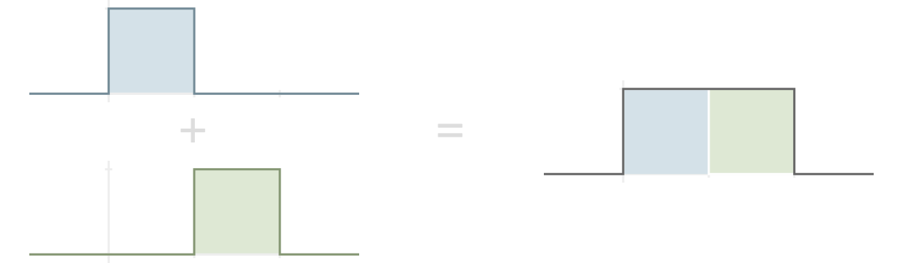
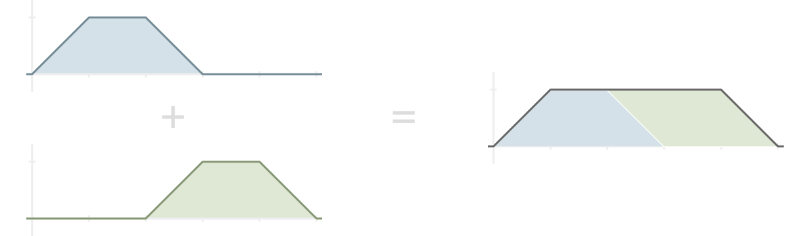
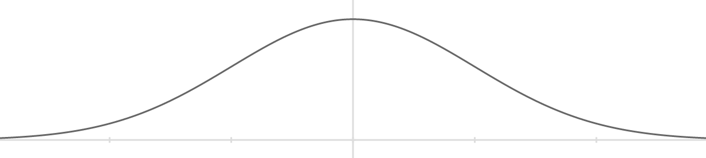

% Self-Replicating Functions
% Tyler Neylon
% 204.2016

These are notes I'm creating for myself as I explore
functions $f$ that can be written as a sum $f = g_1 + g_2$ where $g_1$ and $g_2$
are the same up to symmetry, and both $g_1$ and $g_2$ strongly resemble shifts
of the
original function $f$.
When a function $f$ has these properties, I informally call it a
*self-replicating function*.

Like the word *fractal*, this term is not
rigorously defined — in particular, it depends on the ambiguous
notion of "strong resemblance" — although I plan to investigate more precise
requirements
below.

# Motivation

I became interested in self-replicating functions by working on algorithms to
procedurally generate 3d models of natural-looking trees. When algorithmically
making trees, it makes sense to start from the idea of an
[*L-system*](https://en.wikipedia.org/wiki/L-system), which can
be visualized as a kind of fractal in which a trunk forks into branches that
fork into smaller subranches, this process repeating infinitely.

I noticed that tree-like *L*-systems can have a large amount of
"branch overlap" concentrated around a central area of their apparent surface.
For example, consider the two images below. On the left is a standard
*L*-system along with a histogram showing the density of leaf points along the
edge. Intuitively, the leaf points achieve a reasonable density even toward the
extreme angles of the tree's top. However, the density increases continuously
toward the center.

We could think of each leaf point as doing a certain amount
of work by covering some area along the top of the *L*-system.
Each subtree is so oblivious to its other subtrees that they overlap heavily,
and the central leaf
points end up being highly redundant. To illustrate this redundancy, the
right-hand figure shows the exact same *L*-system with essentially half of
the tree removed — yet the shape formed by the leaf points is only slightly
changed.

One approach to smoothing out the distribution of leaf points would be to
compromise the fractal-like nature of the system by choosing each line direction
based on where it is within the fractal, rather than simply by making each
branching point a smaller version of its parent.
The line directions can be chosen so that
the set of points at a fixed distance from the trunk point
form a set of equidistant angles from a central point.
The result is an extremely
regular edge, as seen below.

This is ideally efficient in that each leaf point is equally important
in forming the shape of the
system. However, this
system is defined in terms of
the path to each point. Is it possible to design a system so
that the overall distribution of leaf points is fairly even, yet each subtree's
shape is independent of its position within the full tree?

If this goal were achieved, we would necessarily have a leaf point distribution
which was the sum of two smaller versions of itself.
Intuitively, the leaf-point distribution of any *L*-system is
already a self-replication function
because, if its two main subtrees have distribution functions $g_1$ and $g_2$,
then the full tree has distribution function $f = g_1 + g_2$.
I have to say *intuitively* here because I haven't formally defined the
leaf-point distribution of an *L*-system.

Thus, *L*-systems naturally coincide with self-replicating functions. Although
there are probably self-replicating functions which do not correspond with
*L*-systems, I nonetheless find it interesting to independently explore the
world of self-replicating functions.

# Simple cases

Technically, any polynomial can be seen as a kind of
self-replicating function. For example, if $f(x) = x^2$,

$$\begin{array}{rcl}
  g_1(x) & = & (x + 1)^2 - 1 = x^2 + 2x, \quad \text{and} \\
  g_2(x) & = & (x - 1)^2 - 1 = x^2 - 2x, \\
\end{array}$$

then $f = g_1 + g_2$, and each $g_i$ is a shift of the original function $f$.
In general, if $f(x) = ax^n + O(x^{n-1})$ then we can choose
$g_i(x) = a(x\pm 1)^n + O(x^{n-1})$ so that $f = g_1 + g_2$,
and each $g_i$ has

$$ \lim_{x\to\pm\infty}\frac{g_i(x)}{f(x)} = 1,$$

which is good enough for me to subjectively say that they strongly
resemble shifts of $f$.

However, the original motivation for self-replicating functions is based on
distribution functions, so the rest of this note focuses on functions $f$
for which $\lim_{x\to\pm\infty}f(x) = 0$.

Another simple approach would be to set $g_1 = g_2 = \frac{1}{2}f$ for
any function $f$. This is not very interesting, and the word *shift* in the
informal definition of a self-replicating function is intended to defeat this
trivial case. That is, each $g_i$ is expected to be similar to a translation of
$f$, such as $f(x-1)$ or $f(x+1)$.

The next function I'll describe is simple and meets all of the requirements so
far. An *indicator function* is a function taking on only the value 0 or 1; it's
also sometimes referred to as a *characteristic function*.
If $f$ is an indicator function, then you can think of those $x$ with $f(x) = 1$
as belonging to the subset of the domain which is *indicated* by the function.
It's handy to use the following bracket notation of Knuth and
others:
given any boolean predicate $P(x)$, let $[P(x)]$ denote the value 1 when $P(x)$
is true, and false otherwise [@taocp1].

Given a half-open interval $[a, b)$, define $I_{[a, b)}$ to be the function
$[x\in[a, b)]$. The following equation shows how such indicator functions can be
considered simple self-replicating functions:
$I_{[0, 2)} = I_{[0, 1)} + I_{[1, 2)}$.

In order to match the equation $f = g_1 + g_2$, emphasizing the similarity
between the $g_i$'s and $f$, we can set $f = I_{[0, 2)}$,
$g_1 = f(2x) = I_{[0, 1)}$, and $g_2 = f(2(x - 1)) = I_{[1, 2)}$.

Things get more interesting when $g_1(x) g_2(x) \ne 0$ for some $x$.
To this end, define the *ramp function* for values $a,b,c,d$ with
$a < b < c < d$ via

$$ J_{a,b,c,d} = \begin{cases}
(x - a) / (b - a) & \text{if } x \in [a, b), \\
1 & \text{if } x \in [b, c), \\
(d - x) / (d - c) & \text{if } x \in [c, d), \text{and} \\
0 & \text{otherwise.} \\
\end{cases}$$

Then $J_{0,1,4,5} = J_{0,1,2,3} + J_{2,3,4,5}$, as illustrated below.

The ramp function example gives me four ideas for further study:

1. The addends and the sum cannot be expressed as linearly related; that is,
   there is no linear function $\ell(x)$ so that
   $J_{0, 1, 2, 3}(\ell(x)) = J_{0, 1, 4, 5}(x)$. Contrast this with the
   interval functions where $I_{[0, 1)}(x / 2) = I_{[0, 2)}$.
   This raises the questions: Which self-replicating functions allow for this
   linear-relation restriction? Is there a slight modification of ramp functions
   which meets this linear-relation restriction?
2. The ramp functions are piece-wise linear, but that linearity is not really
   the key to their being self-replicating. Rather, the key is that the left
   ramp and right ramp sum to 1, which matches the middle height of the
   functions. Which more general self-replicating functions can be constructed
   using this idea?
3. What happens if we treat the sum $f = g_1 + g_2$ as part of a sequence?
   Thinking of *L* and *R* for *left* and *right*,
   let $f^{(0)}_L = J_{0, 1, 2, 3}$, and $f^{(i)}_R = f^{(i)}_L(x-2)$ for
   $i \ge 0$.
   Thinking of *S* for *sum*,
   define $f^{(i+1)}_S = f^{(i)}_L + f^{(i)}_R$ for $i \ge 1$.
   If $f^{(i)}_L$ is positive on $(0, b)$, then $f^{(i)}_R$ is positive on
   $(2, b + 2)$, so $f^{(i+1)}_S$ is positive on $(0, b + 2)$.
   Set $f^{(i+1)}_L = f^{(i+1)}_S(x (b + 2) / b)$ so that we maintain the 
   region on which the left function is positive. In this way, we get a sequence
   of functions. What is the limiting behavior? Can we attempt to extend the
   sequence backwards? Can we say anything in general about the limiting
   behavior of a class of starting functions $f^{(0)}_L$?
4. For the current ramp functions, the middle section is flat with value 1,
   while the edges sum to 1. Can we do something more interesting where the
   edges sum to a non-constant value? I can imagine this leading to a
   discontinuous function. Is there a way to do this where the functions are
   continuous, or at least continuous almost everywhere? Can we describe a
   general class of self-replicating functions which are not continuous, such
   as the indicator function of the Cantor dust?

TODO Mention how I'm following up with further study idea 1.

## Nonlinear ramps

Other curves that sum to 1 could easily take the place of the left and right
edges of the ramp function. For example, the left and right ramps could be
replaced by curves with the shapes $x^2$ and $1-x^2$ on $[0, 1]$, as illustrated
below.

Given any function $f:[0,1]\to [0,1]$ with $f(0) = 0$ and $f(1)=1$ the general
form of this case is the function

$$ K_{a,b,c,d} = \begin{cases}
f\big((x - a) / (b - a)\big) & \text{if } x \in [a, b), \\
1 & \text{if } x \in [b, c), \\
1 - f\big((x - c) / (d - c)\big) & \text{if } x \in [c, d), \text{and} \\
0 & \text{otherwise.} \\
\end{cases}$$

# The normal curve

The normal curve is described by
$y = e^{-x^2/2}$.

# Leaf-point distributions of *L*-systems

# Fractal functions

This section is for functions similar to the Cantor diagonal.
It may turn out that I can't find any functions that fit here, or that the
*L*-systems distributions includes this case, or even that I can prove that no
functions could exist here (as far as I know).

# Temporary example content

**Lemma 1**\ 
*Content of lemma 1, including some $\pi+3$ mathy bits.*

## Subheader

Content

See my notes on Raney's lemmas for more examples.

Here is a reference [@concrete].

# Questions

* The ellipse around my first *L*-system appears to fit surprisingly well.
  Is there a nice way to discover when an ellipse and an *L*-system may fit like
  this? Is there, perhaps, a series of shapes which converge on the system or
  its leaf points, analogous to
  [Mandelbrot set
  lemniscates](http://mathworld.wolfram.com/MandelbrotSetLemniscate.html)?
* The histogram around my first *L*-system appears simple in shape. Can its
  shape be described precisely?

# References

