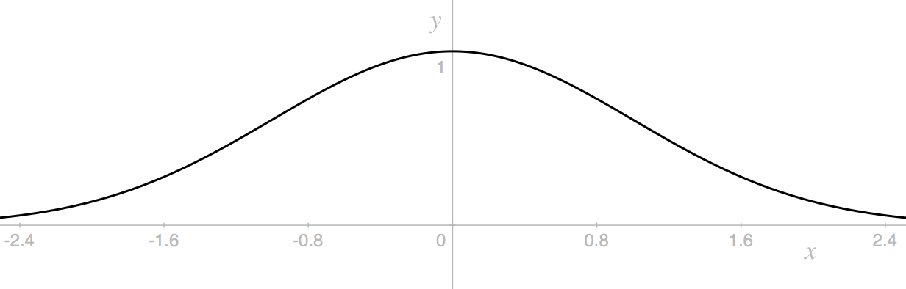

% Self-Replicating Functions
% Tyler Neylon
% 204.2016

These are notes I'm creating for myself as I explore
functions $f$ that can be written as a sum $f = g_1 + g_2$ where $g_1$ and $g_2$
are the same up to symmetry, and both $g_1$ and $g_2$ strongly resemble the
original function $f$.
When a function $f$ has these properties, I informally call it a
*self-replicating function*.

Like the word *fractal*, this term is not
rigorously defined — in particular, it depends on the ambiguous
notion of "strong resemblance" — although I plan to investigate more precise
requirements
below.

# Motivation

I became interested in self-replicating functions by working on algorithms to
procedurally generate 3d models of natural-looking trees. When algorithmically
making trees, it makes sense to start from the idea of an
[*L-system*](https://en.wikipedia.org/wiki/L-system), which can
be visualized as a kind of fractal in which a trunk forks into branches that
fork into smaller subranches, this process repeating infinitely.

I noticed that tree-like *L*-systems can have a large amount of
"branch overlap" concentrated around a central area of their apparent surface.
For example, consider the two images below. On the left is a standard
*L*-system along with a histogram showing the density of leaf points along the
edge. Intuitively, the leaf points achieve a reasonable density even toward the
extreme angles of the tree's top. However, the density increases continuously
toward the center.

We could think of each leaf point as doing a certain amount
of work by covering some area along the top of the *L*-system.
Each subtree is so oblivious to its other subtrees that they overlap heavily,
and the central leaf
points end up being highly redundant. To illustrate this redundancy, the
right-hand figure shows the exact same *L*-system with essentially half of
the tree removed — yet the shape formed by the leaf points is only slightly
changed.

One approach to smoothing out the distribution of leaf points would be to
compromise the fractal-like nature of the system by choosing each line direction
based on where it is within the fractal, rather than simply by making each
branching point a smaller version of its parent.
The line directions can be chosen so that
the set of points at a fixed distance from the trunk point
form a set of equidistant angles from a central point.
The result is an extremely
regular edge, as seen below.

This is ideally efficient in that each leaf point is equally important
in forming the shape of the
system. However, this
system is defined in terms of
the path to each point. Is it possible to design a system so
that the overall distribution of leaf points is fairly even, yet each subtree's
shape is independent of its position within the full tree?

If this goal were achieved, we would necessarily have a leaf point distribution
which was the sum of two smaller versions of itself.
Intuitively, the leaf-point distribution of any *L*-system is
already a self-replication function
because, if its two main subtrees have distribution functions $g_1$ and $g_2$,
then the full tree has distribution function $f = g_1 + g_2$.
I have to say *intuitively* here because I haven't formally defined the
leaf-point distribution of an *L*-system.

Thus, *L*-systems naturally coincide with self-replicating functions. Although
there are probably self-replicating functions which do not correspond with
*L*-systems, I nonetheless find it interesting to independently explore the
world of self-replicating functions.

# Piece-wise linear cases

# The normal curve

The normal curve is described by
$y = e^{-x^2/2}$.

# Leaf-point distributions of *L*-systems

# Temporary example content

**Lemma 1**\ 
*Content of lemma 1, including some $\pi+3$ mathy bits.*

## Subheader

Content

See my notes on Raney's lemmas for more examples.

Here is a reference [@concrete].

# Questions

* The ellipse around my first *L*-system appears to fit surprisingly well.
  Is there a nice way to discover when an ellipse and an *L*-system may fit like
  this? Is there, perhaps, a series of shapes which converge on the system or
  its leaf points, analogous to
  [Mandelbrot set
  lemniscates](http://mathworld.wolfram.com/MandelbrotSetLemniscate.html)?
* The histogram around my first *L*-system appears simple in shape. Can its
  shape be described precisely?

# References

