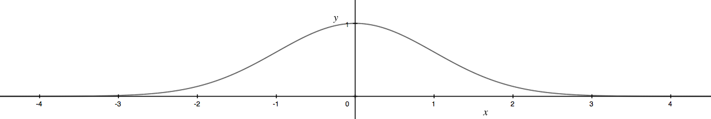

% Self-Replicating Functions
% Tyler Neylon
% 204.2016

These are notes I'm creating for myself as I explore a general idea about
functions that are able to decompose into a sum of symmetric functions that
resemble the original function. I call these functions *self-replicating
functions*.

# An application

TODO Mention L-systems and the idea of even canopy coverage.

# Piece-wise linear cases

# The normal curve

The normal curve is described by
$y = e^{-x^2/2}$.

**Lemma 1**\ 
*Content of lemma 1, including some $\pi+3$ mathy bits.*

## Subheader

Content

See my notes on Raney's lemmas for more examples.

Here is a reference [@concrete].

# References

