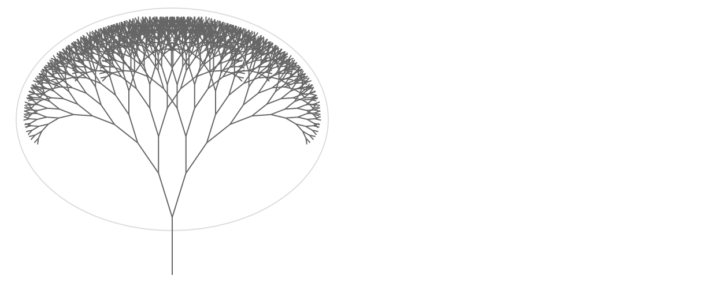

% Self-Replicating Functions
% Tyler Neylon
% 204.2016

These are notes I'm creating for myself as I explore
functions $f$ that can be written as a sum $f = g_1 + g_2$ where $g_1$ and $g_2$
are the same up to symmetry, and both $g_1$ and $g_2$ strongly resemble the
original function $f$.
When a function $f$ has these properties, I informally call it a
*self-replicating function*.

Like the word *fractal*, this term is not
rigorously defined — in particular, it depends on the ambiguous
notion of "strong resemblance" — although I plan to investigate more precise
requirements
below.

# An application

I became interested in self-replicating functions by working on algorithms to
procedurally generate 3d models of natural-looking trees. When algorithmically
making trees, it makes sense to start from the idea of an
[*L-system*](https://en.wikipedia.org/wiki/L-system), which can
be visualized as a kind of fractal in which a trunk forks into branches that
fork into smaller subranches, this process repeating infintely.

TODO Mention L-systems and the idea of even canopy coverage.

# Piece-wise linear cases

# The normal curve

The normal curve is described by
$y = e^{-x^2/2}$.

**Lemma 1**\ 
*Content of lemma 1, including some $\pi+3$ mathy bits.*

## Subheader

Content

See my notes on Raney's lemmas for more examples.

Here is a reference [@concrete].

# References

